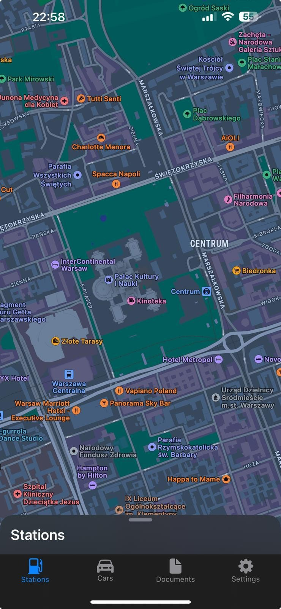

# driversbuddy

Mam plan

Serwis w Azure z cenami na stacjach w polsce (rózne zrodła danych np ceny hurtowe, ceny sprzedazy u dostawcow kart itd)
Aplikacja mobilna iOS na iPhone, iPad, wyswietla ceny na stacjach w promieniu okreslonej liczby kilometrow.
Mozna odfiltrować stacje na dowolny koncern
filtrowac stacje wg uslug, czy ma ladowarki, prysznic, sklep ,itd
Kalkulator kosztu przejazdu trasami z uwzglednieniem cen, z optymalizatorem, gdzie warto zatankowac, aby trasa wyszla najtaniej.

Rejestr pojazdów
rejestrowanie tras np dla potrzeba rozliczania z urzędem skarbowym
rejestrowanie zakupów
import danych z transakcjami shell/orlen/bp inne ..

wykorzystane technologie serwis c# + ms sql (ewentualnie vapor + postgres)
swiftUI, Swift SwiftData

## Postepy w Interfejsie

