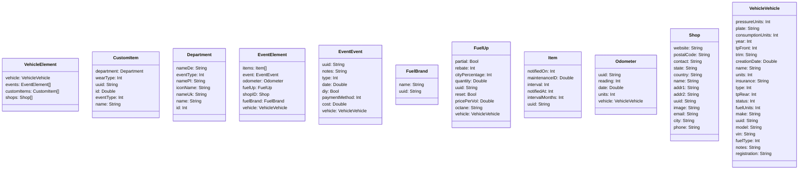
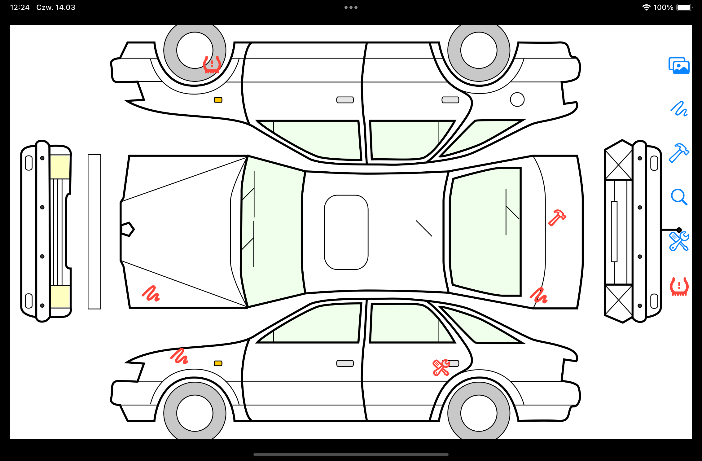
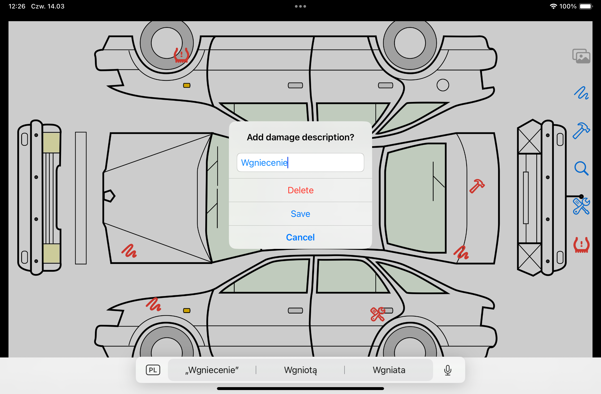
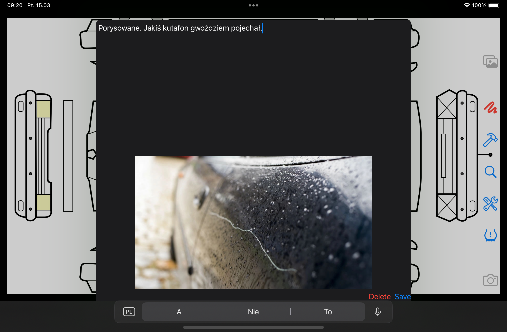

# driversbuddy

Serwis w Azure z cenami na stacjach w polsce (rózne zrodła danych np ceny hurtowe, ceny sprzedazy u dostawcow kart itd)
Aplikacja mobilna iOS na iPhone, iPad, wyswietla ceny na stacjach w promieniu okreslonej liczby kilometrow.
Mozna odfiltrować stacje na dowolny koncern
filtrowac stacje wg uslug, czy ma ladowarki, prysznic, sklep ,itd
Kalkulator kosztu przejazdu trasami z uwzglednieniem cen, z optymalizatorem, gdzie warto zatankowac, aby trasa wyszla najtaniej.

Rejestr pojazdów
- dane o zakupie
- dane o rejestracji
- rejestr zdarzen
  -zakupy
  -tankowania
  -serwis
  -wypożyczanie 
  -oponyy
- przebieg przy kazdym zdarzeniu
  

marki modele i wersje pojazdow
rejestrowanie tras np dla potrzeba rozliczania z urzędem skarbowym
rejestrowanie zakupów
import danych z transakcjami shell/orlen/bp inne ..

rozpoznawanie kodu Aztec z dowodu rejestracyjnego
rozpoznawanie paragonów i faktur zakupowych

wykorzystane technologie serwis c# + ms sql (ewentualnie vapor + postgres)
swiftUI, Swift SwiftData

## Model SwiftData

## Postepy w Interfejsie

Vehicle inspection screen:

Możliwość dodawania opisów uszkodzeń

oraz zdjęć tych uszkodzeń

